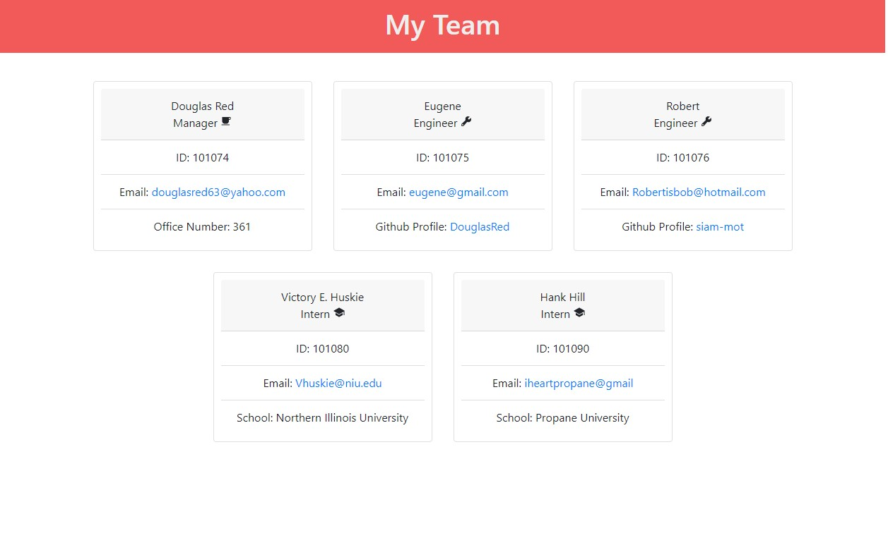

# Team Profile Generator

## Table of Contents

- [Project Description](#Description)
- [Installation](#Installation)
- [Usage](#Usage)
- [Collaborators](#Collaborators)
- [License](#License)
- [GitHub](#GitHub)

## Description

### Motivation for creating this project

I wanted to test my skills with using Test Driven Development (TDD) to create an apllication that would help managers layout their teams and create some what of an one layer organization chart.

### What problem does this solve?

Identifying the strcuture of a team and laying it out nicely with some predefined questions and a template for easy usage.

## Installation

In order to download my code you will have to clone my repo and install inquire by running npm install @8.2.4. If you want to view the test I created with TTD, you will also have to download Jest.

## Usage

This will help any small team list their employees for visibility purposes. Working virtually can take its toll on us including forgetting about the people that work with us.

## Contact Me

See other projects I have created at https://github.com/DouglasRed

Contact me at douglasred63@yahoo.com for any questions you have about my project.

## View My Video

View my video of this project here! https://github.com/DouglasRed/team-profile-generator/blob/main/team-generator-profile.mp4 (Please note: you may have to download this 5 minute video)
